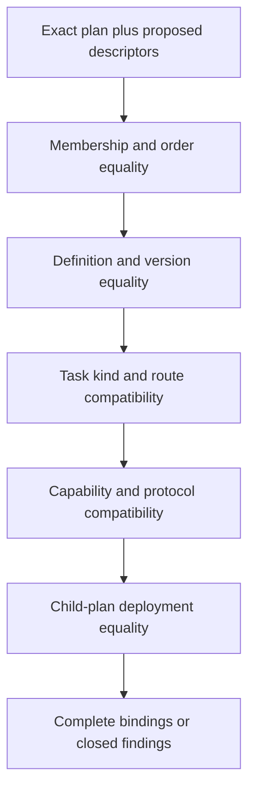

# `WorkflowExecutionBindingsConstructor` schematic

## Responsibility

```mermaid
flowchart TD
    I[Exact plan plus proposed descriptors]
    M[Membership and order equality]
    D[Definition and version equality]
    K[Task kind and route compatibility]
    P[Capability and protocol compatibility]
    C[Child-plan deployment equality]
    O[Complete bindings or closed findings]

    I --> M --> D --> K --> P --> C --> O
```

The engine accepts only the complete aggregate; runtime needs no registry or child-target discovery.
