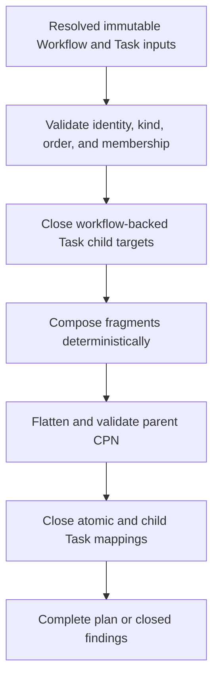

# `WorkflowExecutionPlanConstructor` schematic

## Responsibility

```mermaid
flowchart TD
    I[Resolved immutable Workflow and Task inputs]
    V[Validate identity, kind, order, and membership]
    C[Close workflow-backed Task child targets]
    F[Compose fragments deterministically]
    N[Flatten and validate parent CPN]
    M[Close atomic and child Task mappings]
    O[Complete plan or closed findings]

    I --> V --> C --> F --> N --> M --> O
```

No partial plan crosses the constructor boundary, and no child graph is embedded in the parent plan.
